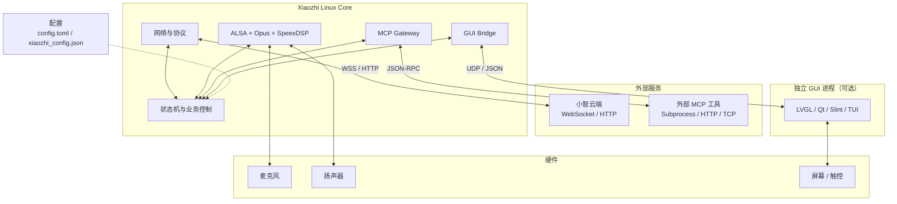

<div align="center">
  

  <h1>Xiaozhi Linux</h1>
  <p>面向 Linux 与嵌入式设备的 Rust 小智 AI 客户端核心</p>

  <a href="https://github.com/haoyn231/xiaozhi_linux_rs/releases/latest"></a>
  <a href="./LICENSE"></a>
  
  
  
  <br>
  <a href="https://github.com/haoyn231/xiaozhi_linux_rs/actions/workflows/cross-compile.yml"></a>
  <a href="https://github.com/haoyn231/xiaozhi_linux_rs/stargazers"></a>

  <p>
    <a href="./README_en.md">English</a> |
    <strong>简体中文</strong>
  </p>
</div>

---

## 📖 项目简介

**Xiaozhi Linux** 是小智 AI 客户端在 Linux 平台上的 Rust 实现，集成云端协议、实时音频、设备激活、业务状态机、GUI 进程通信和 MCP 工具扩展，适用于桌面 Linux、ARM 开发板以及资源受限的嵌入式设备。

项目专注于稳定、轻量的客户端核心，不内置特定 GUI。核心进程通过 UDP 与独立界面通信，可按硬件需求搭配 LVGL、Qt、Slint、TUI，或直接以无界面方式运行。

<p align="center">
  <a href="https://github.com/78/xiaozhi-esp32">小智 ESP32</a> |
  <a href="https://github.com/100askTeam/xiaozhi-linux">百问网 Linux 版</a> |
  <a href="https://github.com/haoyn231/xiaozhi_linux_rs/releases/latest">下载最新版</a> |
  <a href="https://github.com/haoyn231/xiaozhi_linux_rs/issues">问题反馈</a>
</p>

### ✨ 核心特性

- **实时音频**：支持 I2S/USB 声卡、ALSA 采集与播放、Opus 编解码，以及 SpeexDSP 降噪、AGC 和重采样。
- **云端对话**：支持 WebSocket 全双工连接、心跳保活、设备鉴权、Hello 握手、TTS、STT 和控制指令。
- **设备管理**：自动完成设备激活与绑定，持久化 Client ID / Device ID，并管理空闲、聆听、处理、说话和网络错误状态。
- **GUI 解耦**：通过 UDP IPC 同步激活码、运行状态、Toast 和 TTS 字幕，GUI 也可向核心进程发送控制指令。
- **MCP 扩展**：通过配置动态接入 Subprocess、HTTP、TCP 工具，支持同步和后台执行模式，无需修改核心代码。
- **多架构构建**：通过 cross-rs 与版本化 SDK 镜像构建 x86_64、ARMv7 GNU、ARMv7 uClibc 和 AArch64 GNU 目标。

---

## 🧩 系统架构



---

## 🚀 快速开始

### 下载预编译版本

前往 [GitHub Releases](https://github.com/haoyn231/xiaozhi_linux_rs/releases/latest) 下载与设备架构和 C 运行库匹配的可执行文件：

| Release 文件 | 目标环境 |
| :--- | :--- |
| `xiaozhi_linux_rs-x86_64-gnu` | x86_64 Linux / GLIBC |
| `xiaozhi_linux_rs-aarch64-gnu` | AArch64 Linux / GLIBC |
| `xiaozhi_linux_rs-armv7-gnueabihf` | ARMv7 Linux / GLIBC hard-float |
| `xiaozhi_linux_rs-armv7-uclibceabihf` | ARMv7 Linux / uClibc hard-float，主要用于 RV1103/RV1106 |

下载后添加执行权限并运行：

```bash
chmod +x ./xiaozhi_linux_rs-x86_64-gnu
./xiaozhi_linux_rs-x86_64-gnu
```

> Release 中的 GNU 二进制基于 GCC 8.3 工具链构建，需要 GLIBC 2.28 或更高版本。请通过 `ldd --version` 检查设备环境；更旧的系统需要基于对应 sysroot 构建新的版本化 cross SDK 镜像。

### 从源码编译

需要 Rust 1.90、C/C++ 构建工具和 ALSA、Opus、SpeexDSP 开发库。

```bash
git clone https://github.com/haoyn231/xiaozhi_linux_rs.git
cd xiaozhi_linux_rs

# Ubuntu / Debian
sudo apt-get update
sudo apt-get install -y \
    build-essential \
    pkg-config \
    libasound2-dev \
    libopus-dev \
    libspeexdsp-dev

cargo build --release
cargo run --release
```

程序首次启动时会在当前工作目录生成 `xiaozhi_config.json`，并自动写入设备标识。运行前请确认设备具备可用的音频输入、音频输出和网络连接。

### 配置音频设备

使用 ALSA 工具查看可用设备：

```bash
arecord -l
aplay -l
```

然后在首次运行生成的 `xiaozhi_config.json` 中找到并修改输入、输出设备字段，例如：

```json
{
  "capture_device": "plughw:0,0",
  "playback_device": "plughw:1,0"
}
```

完整的设备名格式、查询方法和配置示例见 [音频设备配置说明](./docs/音频设备配置说明.md)。

---

## ⚙️ 配置说明

项目包含两层配置：

- `config.toml`：编译期默认配置，由 `build.rs` 嵌入可执行文件，修改后需要重新编译。
- `xiaozhi_config.json`：运行时配置，首次启动自动生成；修改后重启程序即可生效。

| 配置范围 | 主要内容 |
| :--- | :--- |
| 音频 | 采集/播放设备、下发流格式、播放采样率、声道和缓冲周期 |
| GUI | Core 与 GUI 的 UDP 地址、端口和缓冲区大小 |
| 网络 | WebSocket、OTA 地址、Token、Device ID 和 Client ID |
| Hello | 上行音频格式、采样率、声道和帧时长 |
| MCP | 是否启用网关以及外部工具定义 |

当前网络下发流支持 `opus` 和 `pcm`；`mp3` 配置项已预留，但尚未实现解码。

---

## 🔌 GUI 与 MCP 扩展

### 独立 GUI

Core 默认通过 UDP 与 GUI 进程交换 JSON 消息。可参考以下项目和文档完成适配：

- [LVGL GUI 示例](https://github.com/haoyn231/lvgl_xiaozhi_gui)
- [Slint GUI 示例](https://github.com/haoyn231/slint_xiaozhi_gui)
- [GUI 适配说明](./docs/GUI适配说明.md)

### MCP 工具

MCP Gateway 可从配置中动态加载外部工具，适合接入系统状态查询、屏幕亮度、远程播放器和局域网设备控制等能力。

| 传输方式 | 使用场景 |
| :--- | :--- |
| `subprocess` | 调用本地 Shell、Python 或其他可执行程序 |
| `http` | 调用远端或局域网 HTTP 服务 |
| `tcp` | 与自定义 TCP 服务或硬件网关通信 |

详细字段、执行模式和示例见 [MCP 功能说明](./docs/MCP功能说明.md) 与 [`examples`](./examples) 目录。

---

## 💻 平台支持

状态说明：✅ 已提供 cross-rs 目标配置并完成设备验证　🧪 已提供构建配置，仍欢迎更多设备测试

| Rust Target | C 运行库 | 已验证设备 | 状态 |
| :--- | :--- | :--- | :---: |
| `armv7-unknown-linux-uclibceabihf` | uClibc | Luckfox Pico、Echo-Mate（RV1106） | ✅ |
| `armv7-unknown-linux-gnueabihf` | GLIBC | Luckfox Lyra（RK3506） | ✅ |
| `aarch64-unknown-linux-gnu` | GLIBC | DshanPi-A1（RK3576）、红米手机 2、N1 盒子 | ✅ |
| `x86_64-unknown-linux-gnu` | GLIBC | Arch Linux 笔记本 | ✅ |
| 其他 Linux 目标 | 视平台而定 | 尚未系统验证 | 🧪 |

目标设备需要提供 ALSA 兼容的音频输入和输出。对于未列出的 Linux 开发板、虚拟机和发行版，理论上可以运行，但需要自行确认 C 运行库、`libasound.so.2` 和声卡驱动兼容性。

---

## 🛠️ 交叉编译

应用构建使用 [cross-rs](https://github.com/cross-rs/cross) 和 GHCR 中的版本化 SDK 镜像。工具链、sysroot、ALSA、Opus 与 SpeexDSP 只在 SDK 镜像发布时准备一次；普通 `cross build` 不下载或编译第三方 C 源码。运行时动态链接目标系统的 libc 和 `libasound`，Opus 与 SpeexDSP 以 PIC 静态库链接进可执行文件。

| 目标 | SDK 镜像标签 |
| :--- | :--- |
| ARMv7 uClibc | `armv7-uclibc-sdk-v1` |
| ARMv7 GNU | `armv7-gnu-sdk-v1` |
| AArch64 GNU | `aarch64-gnu-sdk-v1` |
| x86_64 GNU | `x86_64-gnu-sdk-v1` |

以 Luckfox Pico / RV1106 为例：

```bash
cargo install cross --version 0.2.5 --locked
rustup toolchain install nightly-2025-09-14 --profile minimal --component rust-src
RUSTUP_TOOLCHAIN=nightly-2025-09-14 \
  cross build --release --locked --target armv7-unknown-linux-uclibceabihf
```

输出文件位于：

```text
target/armv7-unknown-linux-uclibceabihf/release/xiaozhi_linux_rs
```

GNU 目标使用仓库固定的 Rust 1.90.0，直接将 target 替换为对应三元组即可。也可以在 GitHub Actions 中手动运行 `Cross Compile` 工作流；只有所选目标全部成功时才会创建 Release。SDK 镜像的构建、版本策略和本地验证方式见 [工程基础设施说明](./docs/工程基础设施说明.md)。

---

## 🗺️ 功能边界与规划

- **IoT 与智能家居联动**：协议能力已具备，更多设备侧集成仍在完善。
- **本地离线唤醒与高级 AFE**：当前已提供 Backend/Frontend 接口以及播放参考帧通道，但不内置回声消除、波束成形或唤醒算法；这些能力可由后续 Frontend、BSP 或专用模块实现。
- **OTA**：Linux 中的客户端是独立进程，升级应由系统服务或部署脚本完成二进制原子替换和进程重启，详见 [OTA 功能说明](./docs/OTA功能说明.md)。

---

## 🤝 贡献

欢迎测试更多 Linux 设备、完善 cross SDK、贡献 MCP 示例，或提交 Issue 和 Pull Request。提交代码前请阅读 [贡献指南](./docs/CONTRIBUTING.md)。

QQ群：`695113129`

---

## 🙏 致谢

- [78/xiaozhi-esp32](https://github.com/78/xiaozhi-esp32)
- [100askTeam/xiaozhi-linux](https://github.com/100askTeam/xiaozhi-linux)
- [xinnan-tech/xiaozhi-esp32-server](https://github.com/xinnan-tech/xiaozhi-esp32-server)

---

## 📄 许可证

本项目核心代码基于 [MIT License](./LICENSE) 发布。

构建产物还包含或链接 ALSA、Opus、SpeexDSP 等第三方组件。cross SDK 动态链接系统 `libasound`，并静态链接 Opus 与 SpeexDSP；进行二次开发或分发时，请同时遵守各第三方组件的许可证要求。
